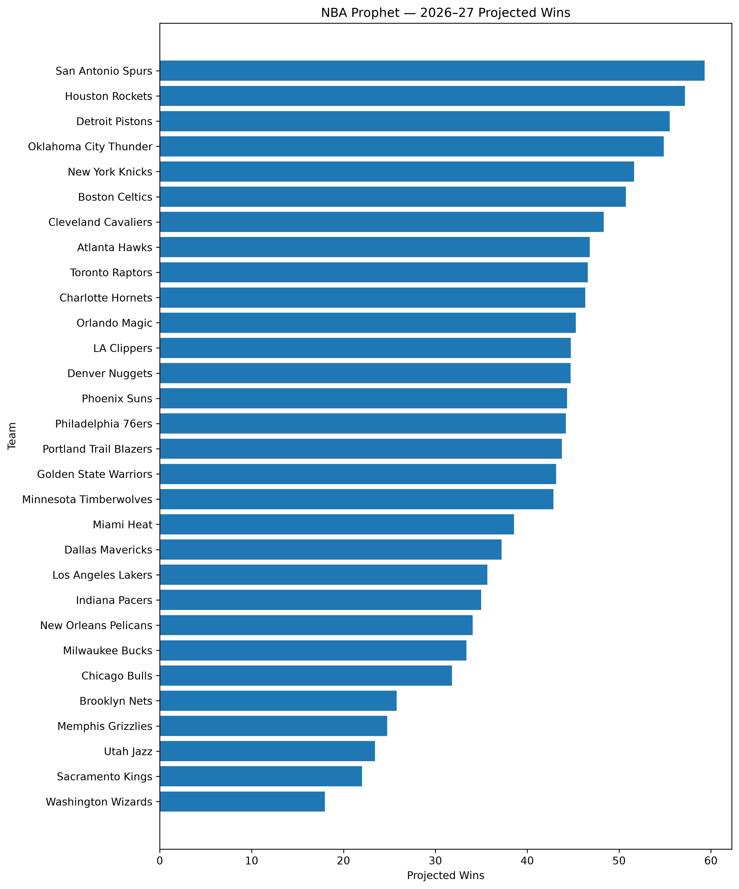

# NBA Prophet

NBA Prophet is a machine learning project that predicts each NBA team's regular-season record for the 2026–27 season.

The project combines historical team performance, player movement, roster continuity, player availability, and roster-change features into a season-to-season prediction model. The final system uses Ridge Regression trained on historical NBA seasons and produces projected win totals for all 30 teams.

## 2026–27 Predictions

NBA Prophet's top five projected teams are:

| Rank | Team | Projected Wins |
|---|---|---:|
| 1 | San Antonio Spurs | 59.3 |
| 2 | Houston Rockets | 57.2 |
| 3 | Detroit Pistons | 55.5 |
| 4 | Oklahoma City Thunder | 54.9 |
| 5 | New York Knicks | 51.6 |

The complete 30-team prediction table is available in:

`nba_prophet_2026_27_predictions.csv`

Predicted league wins are normalized to 1,230, because every NBA game produces exactly one win and one loss.

## Model Performance

NBA Prophet was evaluated using walk-forward historical backtesting.

The final Ridge Regression model achieved:

| Metric | Result |
|---|---:|
| Mean Absolute Error | 6.75 wins/team |
| Median Absolute Error | 6.12 wins |
| 80th percentile error | 10.82 wins |
| 90th percentile error | 13.39 wins |
| 95th percentile error | 15.60 wins |

The model was also evaluated against simpler baselines, including previous-season win percentage and a league-average `.500` prediction.

An additional later-season holdout produced an MAE of approximately 9.0 wins/team while still outperforming both baseline approaches.

## Final Model

The final model is:

`StandardScaler → Ridge Regression (alpha = 2.0)`

Ridge Regression was selected after comparing:

- Ridge Regression
- Elastic Net
- Gradient Boosting

Ridge produced the strongest combination of mean prediction error, median error, worst-season performance, and year-to-year stability.

## Features

NBA Prophet uses 13 final features:

| Feature | Description |
|---|---|
| `NET_RATING` | Team point differential per 100 possessions |
| `TM_TOV_PCT` | Team turnover percentage |
| `DREB_PCT` | Defensive rebounding percentage |
| `AST_RATIO` | Team assist ratio |
| `PACE` | Estimated possessions per game |
| `NET_PPG_CHANGE` | Incoming minus outgoing player scoring |
| `RETAINED_MINUTES` | Share of roster minutes retained |
| `NET_SCORING_LOAD` | Change in scoring production weighted by minutes |
| `NET_EFFICIENCY_LOAD` | Change in efficiency weighted by minutes |
| `NET_USAGE_LOAD` | Change in usage weighted by minutes |
| `NET_PLUS_MINUS_LOAD` | Change in plus-minus production weighted by minutes |
| `CORE_AVAILABILITY_STD_DEV` | Variation in availability among a team's core players |
| `RETURNING_SCORING_SHARE` | Share of previous scoring production retained |

## Roster Modeling

One of the main challenges was representing offseason roster changes.

For every team and season transition, players are classified as:

`RETURNING`, `INCOMING`, or `OUTGOING`

NBA Prophet then calculates how much scoring, efficiency, usage, plus-minus production, and playing time were gained or lost.

The model also accounts for continuity by measuring retained minutes, returning scoring share, and availability of core players.

## Rookie and No-History Players

Players entering the NBA without historical NBA statistics required a separate data pipeline.

College, international, and G League statistics were collected and translated toward expected NBA production using historical player transitions.

To avoid leakage, historical translations were evaluated using out-of-fold rookie predictions.

However, ablation testing showed that adding translated rookie production consistently reduced historical prediction accuracy at every tested weighting level.

As a result, the final predictive model assigns first-entry translated players a predictive weight of zero.

The translation system remains in the project for roster coverage, experimentation, and future model development.

## Validation

Several stress tests were performed before generating the final 2026–27 predictions.

### Model Comparison

Ridge Regression outperformed Elastic Net and Gradient Boosting in the initial seven-season comparison.

### Hyperparameter Testing

Ridge alpha values from `0.1` through `50` were tested.

`alpha = 2.0` was selected because it was essentially tied for the best mean MAE while providing slightly stronger median and worst-season performance.

### Coefficient Stability

12 of the 13 model features maintained the same coefficient sign across all seven historical backtest folds.

`AST_RATIO` was the only feature with inconsistent coefficient direction, and its coefficient magnitude was extremely small.

### Feature Ablation

Removing `NET_RATING` increased prediction error by approximately 1.31 wins/team, making it the strongest individual predictor.

Other important contributors included:

`NET_SCORING_LOAD`

`NET_PLUS_MINUS_LOAD`

`NET_EFFICIENCY_LOAD`

No secondary feature showed enough harmful out-of-sample impact to justify reopening feature selection.

### Future-Data Extrapolation

Every 2026–27 feature value was checked against the historical training distribution.

No future feature exceeded an absolute z-score of 3.0, indicating that the final model is not making predictions from extreme values outside its historical training range.

## Prediction Uncertainty

NBA Prophet reports historical prediction-error bands alongside each point prediction.

For example, a team projected for 50 wins may also receive:

- 80% historical error band: approximately ±10.8 wins
- 90% historical error band: approximately ±13.4 wins
- 95% historical error band: approximately ±15.6 wins

These are empirical historical prediction-error bands, not formal statistical confidence intervals.

They represent how large NBA Prophet's prediction errors were across historical walk-forward tests.

## Project Pipeline

Historical NBA data
→ Player and team feature engineering
→ Season-to-season roster comparison
→ Availability and continuity modeling
→ Rookie/no-history processing
→ Walk-forward historical validation
→ Model comparison and tuning
→ Final Ridge model
→ 2026–27 feature construction
→ 30-team win predictions
→ League-win normalization
→ Historical error bands

## Technologies

Python

pandas

NumPy

scikit-learn

nba_api

## Project Status

The predictive pipeline and 2026–27 projections are complete.

Current work focuses on visualization, documentation, interpretability, and portfolio presentation.

## 2026–27 Projected Wins

## Limitations and Future Work

NBA Prophet is designed as a season-level prediction model, so several important sources of uncertainty remain.

### Limitations

- Injuries, suspensions, trades, and roster changes that occur after the prediction date are not reflected automatically.
- Rookie and first-NBA-entry player translations were tested historically but were excluded from the final predictive features because they reduced validation performance.
- The model does not explicitly simulate the NBA schedule or opponent strength game-by-game.
- Several roster-change features are correlated, so individual Ridge coefficients should be interpreted as model associations rather than causal basketball effects.
- Historical prediction-error bands describe past model error and are not formal statistical confidence intervals.
- Team performance can change dramatically because of coaching changes, player development, chemistry, or unexpected breakout seasons that are difficult to quantify before the season.

### Future Work

Potential future improvements include:

- player aging and development curves
- injury probability and expected-games-played modeling
- schedule-strength adjustments
- game-by-game season simulation
- improved rookie and international-player translation models
- player-level projections feeding into team-level predictions
- probabilistic win distributions rather than only point estimates